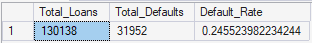
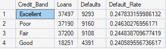

# Financial Risk Analysis Project

This project demonstrates a credit risk analysis using SQL on a loan dataset. The goal is to explore the dataset, clean it, calculate key risk indicators, and analyze default rates based on various factors such as credit score, debt-to-income ratio (DTI), and loan-to-value ratio (LTV).

---

## Dataset
- Contains loan information including:
  - Loan amount, income, credit score, DTI, LTV
  - Loan type, purpose, region, borrower demographics
  - Loan status (default vs. non-default)
- Data is fictional and used for educational purposes.
- The dataset is too large to include here, however it was sourced from Kaggle.

---

## Business Problem

A financial institution seeks to assess borrower default risk to improve underwriting decisions and reduce expected credit losses.
---
## Dataset Overview
- 148,670 rows
- 34 columns
- Borrower characteristics
- Loan structure variables
- Credit metrics

---
## Methodology
 1. Data cleaning & exploration perofrmed in SQL
 2. Feature engineering and analysis in SQL

---

## Project Steps

1. **Database and Table Creation**
   - Create a new SQL database `FinancialRisk`.
   - Define the raw loan table structure `loan_raw`.

2. **Data Exploration**
   - Preview top records.
   - Count total rows and identify missing or anomalous values.

3. **Data Cleaning**
   - Handle missing or invalid values (e.g., median imputation for LTV).
   - Create a cleaned table `loan_cleaned`.

4. **Feature Engineering**
   - Add indicators for high DTI risk and high LTV risk.

5. **Analysis**
   - Calculate overall default rate.
   - Analyze defaults by credit score bands (Poor, Fair, Good, Excellent).
   - Identify high-risk loans meeting multiple risk criteria.

---

## Key SQL Queries

**Total defaults and default rate:**
```sql
SELECT COUNT(*) AS Total_Loans,
       SUM(CAST(Status AS INT)) AS Total_Defaults,
       CAST(SUM(CAST(Status AS INT)) AS FLOAT)/COUNT(*) AS Default_Rate
FROM loan_cleaned;
```
**Credit score band analysis:**
```sql
SELECT CASE 
         WHEN Credit_Score < 600 THEN 'Poor' 
         WHEN Credit_Score BETWEEN 600 AND 699 THEN 'Fair' 
         WHEN Credit_Score BETWEEN 700 AND 749 THEN 'Good' 
         ELSE 'Excellent' 
       END AS Credit_Band,
       COUNT(*) AS Loans,
       SUM(CAST(Status AS INT)) AS Defaults,
       SUM(CAST(Status AS FLOAT)) / COUNT(*) AS Default_Rate
FROM loan_cleaned
GROUP BY CASE 
           WHEN Credit_Score < 600 THEN 'Poor' 
           WHEN Credit_Score BETWEEN 600 AND 699 THEN 'Fair' 
           WHEN Credit_Score BETWEEN 700 AND 749 THEN 'Good' 
           ELSE 'Excellent' 
         END
ORDER BY Default_Rate DESC;
```
**Identify high-risk loans:**
```sql
SELECT * FROM loan_cleaned
WHERE High_DTI_Risk = 1
  AND High_LTV_Risk = 1
  AND Credit_Score < 650;
```
---


---

## Business Recommendations (based off of the analysis)

The findings suggest that layered risk indicators (high DTI + high LTV + lower credit scores) significantly increase default probability. The organization should incorporate multi-factor risk scoring into underwriting and capital allocation decisions to proactively manage credit exposure.

---

## Tools Used

 - SQL Server Management Studio (SSMS)
 - T-SQL for database creation, cleaning, feature engineering, and analysis.
---
## Key Leanings

 - Learned to clean and preprocess financial datasets in SQL.
 - Built risk indicators to flag high-risk loans.
 - Gained experience calculating default rates and performing risk segmentation. 

